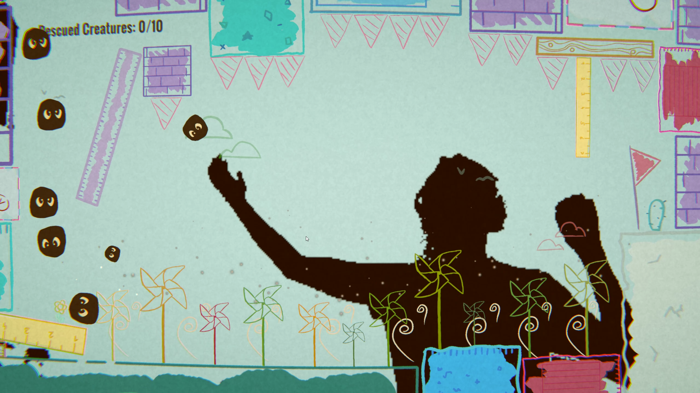

# Förglets
#### A game by [Kevin La](https://github.com/FairySworder), [Paul Huemer](https://github.com/Paul-Huemer), and [Felix Rader](https://github.com/s1910238061)

## Table of Contents
- [Förglets](#förglets)
      - [A game by Kevin La, Paul Huemer, and Felix Rader](#a-game-by-kevin-la-paul-huemer-and-felix-rader)
  - [Table of Contents](#table-of-contents)
  - [Basic Concept](#basic-concept)
  - [Gameplay](#gameplay)
  - [Hardware Requirements](#hardware-requirements)
  - [Software Requirements](#software-requirements)
  - [Installation](#installation)
    - [Kinect Installation](#kinect-installation)
    - [Python and OBS Installation](#python-and-obs-installation)
      - [Python Installation](#python-installation)
  - [Unity](#unity)
  - [Credits and Acknowledgements](#credits-and-acknowledgements)

## Basic Concept
Förglets is an interactive projection-based game installation using the player's silhouette as a collision object in this Lemmings-inspired game. Small creatures want to get from one place to another. The player has to help them overcome various obstacles in carefully crafted small worlds.



## Gameplay
Small creatures are trying to get to a predefined goal. Without the player’s help, they will meet their end quickly. The player has to use their silhouette to guide the creatures to the goal. The creatures collide with the silhouette, enabling the player to pick them up, build bridges, block them from running to their death, and similar scenarios. On each level completion, a new level is started. If the creatures meet their end, they simply respawn to the start, enabling players to leave and start at any time.

## Hardware Requirements
- Xbox One Kinect with USB to Kinect Kit
- PC with a capable graphics card
- Projection on the wall: Minimum Size of 3.00 x 3.00 m
- Game Area: 3.00 x 3.00 metres
- Tape to mark this Game Area
- Backend:
  - 1 PC with one USB A 3.0 Slot, preferably with a dedicated graphics card (GTX 1070 or newer)
  - Xbox One Kinect
  - Power Supply for the PC and the Kinect

## Software Requirements
- Windows 10 or Windows 11
- Python 3.10.X
- OBS
- Kinect V2 Drivers
- Kinect Software

## Installation
The installation of this game can be tricky, as it uses the Kinect which is not officially supported anymore by Microsoft.

### Kinect Installation
1. Install the Kinect V2 Drivers from the [Microsoft Website](https://www.microsoft.com/en-us/download/details.aspx?id=44561)
2. Connect the Kinect to the PC
3. Start the Kinect Studio and check if the Kinect is working
4. If the Kinect is not working, try to restart the PC

### Python and OBS Installation
This game uses Python to get the Kinect data video, as it turned out to be the most reliable and most performant way to get the data. OBS is used to project the Python output window into a virtual camera, which can be used in the Unity game engine.

#### Python Installation
As the official PyKinect library was last updated 8 years ago, it is not compatible anymore and needs to be patched by an unofficial fork which was created by Github User [Sujith Christopher](https://github.com/SujithChristopher).

1. Install Python 3.10.X from the [Python Website](https://www.python.org/downloads/)
2. Install the pykinect2 library by running:
    ```sh
    pip install pykinect2
    ```

Now we need to patch the PyKinect2 library to work with Python 3.10.X:

1. Download the [PyKinect2 Fork](https://github.com/SujithChristopher/PyKinect2) from GitHub
2. Extract the "pykinect2" folder from the downloaded zip file
3. Go to the Python installation folder and navigate to the "Lib/site-packages" folder: e.g., `C:\Users\Username\AppData\Local\Programs\Python\Python310\Lib\site-packages`
4. Go into the "pykinect2" folder and replace all three .py files with the ones from the downloaded zip file.

Now the kinect.py file that is included in our repository should work with Python 3.10.X. It can be launched by running:
```sh
python kinect.py
``` 
in the command line when in the correct directory.

### OBS Installation
1. Install OBS from the [OBS Website](https://obsproject.com/)
2. Open OBS and add a new source by clicking the "+" button in the sources section
3. Select "Window Capture" and select the Python window that is running the `kinect.py` script.
4. Make sure that the Python Kinect window from the `kinect.py` script is running
5. Select the Kinect output window under the "Window" dropdown menu and press okay.
6. Now the resolution of the OBS Virtual Camera needs to be set. Go to the settings and select the "Video" tab. Set the resolution to `512x288` and the FPS to `30`. This is a 16:9 resolution that is compatible with the Unity game. It is not higher as the depth camera of the Kinect has very low resolution. We do not want to upscale the image as the lower the resolution the better the performance.
7. Now we can drag the window to the correct position and size in the OBS window. Make sure that the floor and walls are not visible in the OBS window, as this could make the game unplayable.
8. Now we need to start the Virtual Camera. Go to the "Controls" section and press "Start Virtual Camera".
9. Now the Virtual Camera is running and can be used in Unity.
10. Open the Unity Game.

## Unity
The whole game is played with the silhouette of the player, so theoretically there are no keybindings needed. However, as the game is still in development and the game is physics-based, we have to implement some keybindings in case the game gets stuck. The keybindings are as follows:
- `R` to restart the level
- `N` to skip to the next level
- `ESC` press it multiple times to exit the game

## Credits and Acknowledgements
- **Water Shader Tutorial:** The water inside the game was created with the help of a tutorial by "Memory Leak" on YouTube. You can find the tutorial [here](https://www.youtube.com/watch?v=69sBjqMtZCc&t=334s&pp=ygUOMmQgd2F0ZXIgdW5pdHk%3D). The water shader was modified to fit our specific needs.
- **PyKinect Library:** The PyKinect library was patched to newer Python versions by [Sujith Christopher](https://github.com/SujithChristopher). You can access the library [here](https://github.com/SujithChristopher/PyKinect2).
- **OpenCV Unity Plugin:** We used the OpenCV Unity Plugin by "Paper Plane Tools" to make the webcam data interact with the Unity game. The plugin is available [here](https://assetstore.unity.com/packages/tools/integration/opencv-plus-unity-85928). It is a free asset, easy to use, and offers a lot of features.
- **OpenCV Plugin Tutorial:** A tutorial for the OpenCV Plugin by "Matt Bell" was instrumental in getting us started. You can find the tutorial [here](https://www.youtube.com/watch?v=ZV5eejYG6NI). It provides an excellent introduction to the basics of the plugin and its usage in Unity.
